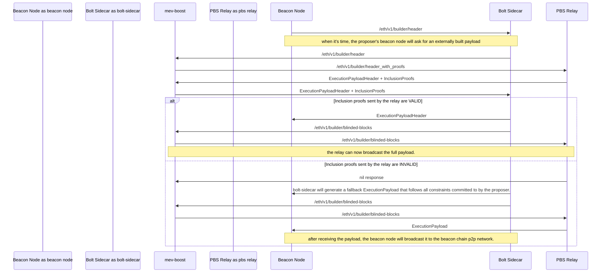

<div align="center">
  <picture>
    <source srcset="./.github/assets/bolt-logo-wm-dark.png" media="(prefers-color-scheme: dark)">
    <source srcset="./.github/assets/bolt-logo-wm-light.png" media="(prefers-color-scheme: light)">
    
  </picture>
</div>

<div align="center">

[][docs]
[][twitter]
[][discord]

</div>

> [!IMPORTANT]
> Bolt is an implementation of _permissionless proposer commitments through
> PBS_. In its essence, it consists in a light fork of the current MEV-Boost
> stack that allows users to request **preconfirmations** from proposers, and
> then adds a way for proposers to commit to transaction inclusion in a way that
> is easily verifiable.

<!-- vim-markdown-toc Marked -->

- [How it works](#how-it-works)
- [Scope of this repository](#scope-of-this-repository)
- [Devnet and demo app](#devnet-and-demo-app)
  - [Requirements and setup](#requirements-and-setup)
  - [Running the devnet and demo](#running-the-devnet-and-demo)
  - [Stopping the devnet and demo](#stopping-the-devnet-and-demo)

<!-- vim-markdown-toc -->

## How it works

The flow of Bolt can be summarized in the following steps:

1. Users submit transactions to an RPC endpoint that will forward them to the
   proposer opted-in to Bolt in the consensus lookahead window.
2. The proposer can accept this request and turn it into a "constraint" on the block
   that it is going to propose. This constraint acts as guarantee of inclusion of
   the transaction in the block, also known as a _preconfirmation_.
3. Builders subscribe to proposer constraints in real time through a new relay
   streaming endpoint to keep informed about the preconfirmations.
4. Builders build valid blocks that adhere to all constraints, and append inclusion
   proofs together with the bids to the relay.
5. When it's time to propose a block, the proposer will fetch the best valid bid
   from the relay, and verify its inclusion proofs locally before signing the header.
6. If the constraints are respected, the proposer can propose the payload as usual
   by sending the signed header back to the relay. If not, the proposer can self-build
   a payload and propose it directly instead.

The following diagram illustrates the flow:



## Scope of this repository

This repository contains all the necessary components to illustrate the flow
described above. It can be thought of a reference implementation.
In particular, the core components are:

- [**Bolt Sidecar**](./bolt-sidecar/): New validator software (akin to [mev-boost][fb-mev-boost])
  that handles the receipt of preconfirmation requests from users, translates them
  into constraints, and forwards them to relays. Additionally, it handles the
  fallback logic to produce a block locally when relays send invalid inclusion proofs.
- [**Builder**](./builder/): A fork of the [Flashbots builder][fb-builder] that
  subscribes to new constraints from relays, builds blocks that respect them, and
  includes the necessary proofs of inclusion in the bid submitted to relays.
- [**Relay**](./mev-boost-relay/): A fork of the [Flashbots relay][fb-relay] that
  receives constraints from proposers, and forwards them to builders. It also
  receives bids with proofs of inclusion from builders, verifies them and forwards
  the best bid to proposers for block proposal.
- [**MEV-Boost**](./mev-boost/): A fork of the [Flashbots MEV-Boost][fb-mev-boost] sidecar
  that includes new API endpoints to proxy requests from the Bolt Sidecar to the connected relays.
- [**Bolt Contracts**](./bolt-contracts/): A set of smart contracts for peripheral functionality
  such as proposer registration and permissionless dispute resolution for attributable faults.

Additionally, this repository contains the necessary scripts to spin up a [Kurtosis][kurtosis] devnet
with all the components running, and a simple [web demo](./bolt-web-demo/) to showcase the preconfirmation flow.

## Devnet and demo app

We are using a full [Kurtosis][kurtosis] devnet stack, with custom Docker images
for the core components outlined above. The exact version of the Ethereum-package used
in our devnet can be seen [here](https://github.com/chainbound/ethereum-package).

### Requirements and setup

8GB of RAM and a modern laptop CPU are recommended to run the devnet efficiently,
but it should work on most machines. Please [Open an issue][new-issue] if you encounter any problems.

Make sure you have the following requirements on your machine:

- [Docker engine](https://docs.docker.com/engine/install/) installed and running
- [Just](https://github.com/casey/just) installed
- [Kurtosis CLI](https://docs.kurtosis.com/install/) installed
- [Foundry](https://book.getfoundry.sh/getting-started/installation) installed

> [!WARNING]
> The Kurtosis CLI version tested is `0.88.16`. Some issues may arise if you are
> using a different version. Please make sure to install the correct version.

Then, clone this repository and navigate to the root directory of the project:

```shell
git clone git@github.com:chainbound/bolt.git && cd bolt
```

### Running the devnet and demo

Running the devnet and demo is straightforward once you have the requirements
installed. Just run the following commands in your terminal:

```shell
# build all necessary docker images locally first
just build-images

# spin up the kurtosis devnet on your machine
just up

# run the web demo servers.
just demo
```

The web demo will be available on your browser at [`http://localhost:3000`](http://localhost:3000).

### Stopping the devnet and demo

The demo app will remain open until you press `Ctrl+C` in the terminal where
you ran the `just demo` command.

To stop the devnet, run the following command:

```shell
# if you want to simply stop all running containers
just down

# if you want to remove all the data and stop the Kurtosis engine
just clean
```

> [!WARNING]
> Remember to shut down the devnet environment when you are done with it, as it
> consumes significant resources (CPU & RAM) on your machine.

<!-- Links -->

[twitter]: https://twitter.com/chainbound_
[discord]: https://discord.gg/pK8GgjxYQS
[docs]: https://chainbound.github.io/bolt-docs/
[new-issue]: https://github.com/chainbound/bolt/issues/new
[fb-mev-boost]: https://github.com/flashbots/mev-boost
[fb-relay]: https://github.com/flashbots/mev-boost-relay
[fb-builder]: https://github.com/flashbots/builder
[kurtosis]: https://www.kurtosis.com/

## License
MIT. Forked repositories have their own licenses.
