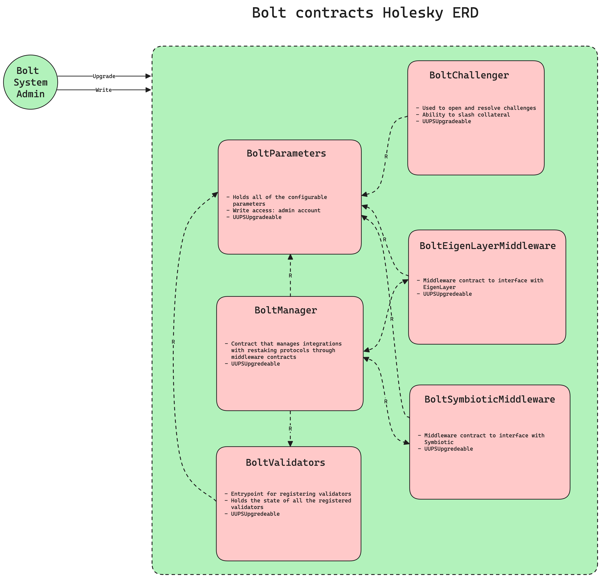

# Bolt Contracts

## Table of Contents

- [Overview](#overview)
  - [Architecture](#architecture)
- [Admin Privileges](#admin-privileges)
- [Validator Registration: `BoltValidators`](#validator-registration-boltvalidators)
- [Bolt Network Entrypoint: `BoltManager`](#bolt-network-entrypoint-boltmanager)
- [Fault Proof Challenge and Slashing: `BoltChallenger`](#fault-proof-challenge-and-slashing-boltchallenger)
- [Holesky Deployments](#holesky-deployments)
- [Testing](#testing)
- [Security Considerations](#security-considerations)
- [Conclusion](#conclusion)

## Overview

The Bolt smart contracts cover the following components:

- Registration and delegation logic for validators to authenticate and opt-in to Bolt
- Operator registration and collateral deposits through flexible restaking protocol integrations (EigenLayer & Symbiotic)
- Fault proof challenges and resolution *without slashing*

### Architecture
A high-level overview of architecture is depicted in the diagram below:



**Notes**
- All contracts are upgradeable by implementing [ERC1967Proxy](https://docs.openzeppelin.com/contracts/4.x/api/proxy#erc1967).
- Storage layout safety is maintained with the use of [storage gaps](https://docs.openzeppelin.com/upgrades-plugins/1.x/writing-upgradeable#storage-gaps) and validated with the [OpenZeppelin Foundry Upgrades toolkit](https://github.com/OpenZeppelin/openzeppelin-foundry-upgrades). 
- There is a single admin address operated by the Bolt team to facilitate upgrades and update system-wide parameters.

## Admin Privileges

The smart contracts are deployed with a single administrator account operated by the Bolt team. In this testnet deployment, all contracts are upgradeable
and multiple system-wide parameters can be changed by this administrator in the case of bugs, hacks, or other critical events.

## System-wide Parameters: `BoltParameters`

[`BoltParameters`](./src/contracts/BoltParameters.sol) is an upgradeable storage contract that stores system-wide parameters that the other
contracts can read from. An overview is given in the table below:

| Parameter            | Initial Value   | Mutable after deployment |
| -------------------- | --------------- | ------------------------ |
| `EPOCH_DURATION`     | 86400 (1 day)   | No                       |
| `SLASHING_WINDOW`    | 604800 (1 week) | No                       |
| `BLOCKHASH_EVM_LOOKBACK` | 256         | No                       |
| `ETH2_GENESIS_TIMESTAMP` | 1694786400  | No                       | 
| `SLOT_TIME` | 12  | No                       | 
| `JUSTIFICATION_DELAY` | 32             | Yes (by admin)                       |
| `MINIMUM_OPERATOR_STAKE`    | 1 ether | Yes (by admin)            |
| `MAX_CHALLENGE_DURATION` | 604800 (1 week) | Yes (by admin)       |
| `CHALLENGE_BOND`     | 1 ether         | Yes (by admin)           |
| `ALLOW_UNSAFE_REGISTRATION` | `true`   | Yes (by admin)           |

The values of these parameters can also be found in [`config.holesky.json`](./config/config.holesky.json).

## Validator Registration: `BoltValidators`

The [`BoltValidators`](./src/contracts/BoltValidators.sol) contract is the only point of entry for
validators to signal their intent to participate in Bolt Protocol and authenticate with their BLS private key.

The registration process includes the following steps:

1. Validator signs a message with their BLS private key. This is required to prove that the
   validator private key is under their control and that they are indeed its owner.
2. Validator calls the `registerValidator` function providing:
   1. Their BLS public key
   2. The BLS signature of the registration message
   3. The address of the authorized collateral provider
   4. The address of the authorized operator

Until the Pectra hard-fork will be activated, the contract will also expose a `registerValidatorUnsafe` function
that will not check the BLS signature. This is gated by a feature flag that will be turned off post-Pectra and
will allow us to test the registration flow in a controlled environment.

## Bolt Network Entrypoint: `BoltManager`

The [`BoltManager`](./src/contracts/BoltManager.sol) contract is a crucial component of Bolt that
integrates with restaking ecosystems Symbiotic and Eigenlayer. It manages the registration and
coordination of validators, operators, and vaults within the Bolt network.

Key features include:

1. Retrieval of operator stake and proposer status from their pubkey
2. Integration with Symbiotic
3. Integration with Eigenlayer

Specific functionalities about the restaking protocols are handled inside
the `IBoltMiddleware` contracts, such as `BoltSymbioticMiddleware` and `BoltEigenlayerMiddleware`.

## Fault Proof Challenge: `BoltChallenger`

The [`BoltChallenger`](./src/contracts/BoltChallenger.sol) contract is the component responsible
for handling fault attribution in the case of a validator failing to meet their commitments.

In short, the challenger contract allows any user to challenge a validator's commitment by opening
a dispute with the following inputs:

1. The signed commitment made by the validator (or a list of commitments on the same slot)
2. An ETH bond to cover the cost of the dispute and disincentivize frivolous challenges

The entrypoint is the `openChallenge` function. Once a challenge is opened, a `ChallengeOpened` event
is emitted, and any arbitrator has a time window to submit a valid response to settle the dispute.

### Dispute resolution

The dispute resolution process is one-shot and requires the arbitrator to submit all necessary evidence
of the validator's correct behaviour within the challenge time window.

The arbitrator is _anyone_ who can submit a valid response to the challenge. It doesn't have to be the
validator themselves. There is however one limitation: the time window for submitting a response must be
respected in the following way:

- Start: the target block must be justified by LMD-GHOST: a minimum of 32 slots must have passed
- End: depending on the EVM block hash oracle:
  - . If using the `BLOCKHASH` EVM opcode, the window is limited to 256 blocks (roughly 1 hour)
  - . If using the [EIP-2935](https://eips.ethereum.org/EIPS/eip-2935) historical oracle, the window is limited to 8192 blocks (roughly 1 day)

The inputs to the resolution process are as follows:

1. The ID of the challenge to respond to: this is emitted in the `ChallengeOpened` event and is unique.
2. The [inclusion proofs](https://github.com/chainbound/bolt/blob/6c0f1b696cfe3de7e7e3830ac28c369c6ddf271e/bolt-contracts/src/interfaces/IBoltChallenger.sol#L39), consisting of the following components:
   a. the block number of the block containing the committed transactions (we call it "inclusionBlock")
   b. the RLP-encoded block header of the block **before** the one containing the committed transactions (we call it "previousBlock")
   b. the RLP-encoded block header of the block containing the included transactions (aka "inclusionBlock")
   c. the account merkle proofs of the sender of the committed transactions against the previousBlock's state root
   d. the transaction merkle proofs of the included transactions against the inclusionBlock's transaction root
   e. the transaction index in the block of each included transaction

If the arbitrator submits a valid response that satisfies the requirements for the challenge, the
challenge is considered `DEFENDED` and the challenger's bond is slashed to cover the cost of the dispute
and to incentivize speedy resolution.

If no arbitrators respond successfully within the challenge time window, the challenge is considered
`BREACHED` and anyone can call the `resolveExpiredChallenge()` method. The `BoltChallenger` will keep
track of this information for future reference.

<!-- ### Slashing of validators

TODO: uncomment when slashing is live

If a challenge is `BREACHED` (as per the above definition), the validator's stake should be slashed to cover
the cost of a missed commitment. This is done by calling the `slash` function on the correct staking adapter
and reading into the `BoltChallenger` contract to trustlessly determine if the challenge was lost.

In practice, slashing behaviour is abstracted behind any staking adapter – an example is Symbiotic's `VetoSlasher`
which will receive a request to slash a validator's stake and will have a last opportunity to veto
the slashing request before it is executed on-chain.

Subscribing to breached challenge events from the `BoltChallenger` is a trustless way to determine if a slashing
request is valid according to Bolt Protocol rules. -->

## Holesky Deployments

| Name                   | Address                | Notes                   |
| ---------------------- | -------------------- | ----------------------- |
| [`BoltParametersV1`](./src/contracts/BoltParametersV1.sol) | [0x20d1cf3A5BD5928dB3118b2CfEF54FDF9fda5c12](https://holesky.etherscan.io/address/0x20d1cf3A5BD5928dB3118b2CfEF54FDF9fda5c12) | Proxy: [`ERC1967Proxy@5.0.0`](https://github.com/OpenZeppelin/openzeppelin-contracts/blob/release-v5.0/contracts/proxy/ERC1967/ERC1967Proxy.sol) |
| [`BoltValidatorsV1`](./src/contracts/BoltValidatorsV1.sol) |  [0x47D2DC1DE1eFEFA5e6944402f2eda3981D36a9c8](https://holesky.etherscan.io/address/0x47D2DC1DE1eFEFA5e6944402f2eda3981D36a9c8) | Proxy: [`ERC1967Proxy@5.0.0`](https://github.com/OpenZeppelin/openzeppelin-contracts/blob/release-v5.0/contracts/proxy/ERC1967/ERC1967Proxy.sol) |
| [`BoltManagerV1`](./src/contracts/BoltManagerV1.sol) |  [0x440202829b493F9FF43E730EB5e8379EEa3678CF](https://holesky.etherscan.io/address/0x440202829b493F9FF43E730EB5e8379EEa3678CF) | Proxy: [`ERC1967Proxy@5.0.0`](https://github.com/OpenZeppelin/openzeppelin-contracts/blob/release-v5.0/contracts/proxy/ERC1967/ERC1967Proxy.sol) |
| [`BoltEigenLayerMiddlewareV1`](./src/contracts/BoltEigenLayerMiddlewareV1.sol) |  [0xa632a3e652110Bb2901D5cE390685E6a9838Ca04](https://holesky.etherscan.io/address/0xa632a3e652110Bb2901D5cE390685E6a9838Ca04) | Proxy: [`ERC1967Proxy@5.0.0`](https://github.com/OpenZeppelin/openzeppelin-contracts/blob/release-v5.0/contracts/proxy/ERC1967/ERC1967Proxy.sol) |
| [`BoltSymbioticMiddlewareV1`](./src/contracts/BoltSymbioticMiddlewareV1.sol) |  [0x04f40d9CaE475E5BaA462acE53E5c58A0DD8D8e8](https://holesky.etherscan.io/address/0x04f40d9CaE475E5BaA462acE53E5c58A0DD8D8e8) | Proxy: [`ERC1967Proxy@5.0.0`](https://github.com/OpenZeppelin/openzeppelin-contracts/blob/release-v5.0/contracts/proxy/ERC1967/ERC1967Proxy.sol) |

## Testing

We use Forge, a fast and flexible Ethereum testing framework, for our smart contract tests.
Here's a guide to running the test suite for the Bolt contracts:

1. Make sure you have Forge installed. If not, follow the [installation guide](https://book.getfoundry.sh/getting-started/installation).

2. Navigate to the `bolt-contracts` directory

3. Run all tests

   ```
   forge test
   ```

4. Run tests with verbose output:

   ```
   forge test -vvv
   ```

## Security Considerations

While the Bolt Contracts have been designed with security best practices in mind, it's important
to note that they are still undergoing audits and should not be used in production environments without
thorough review and testing. As with any smart contract system, users should exercise caution and conduct
their own due diligence before interacting with these contracts.

The following considerations should be taken into account before interacting with smart contracts:

- Restaking is a complex process that involves trusting external systems and smart contracts.
- Validators should be aware of the potential for slashing if they fail to meet their commitments or engage in malicious behavior.
- Smart contracts are susceptible to bugs and vulnerabilities that could be exploited by attackers.
