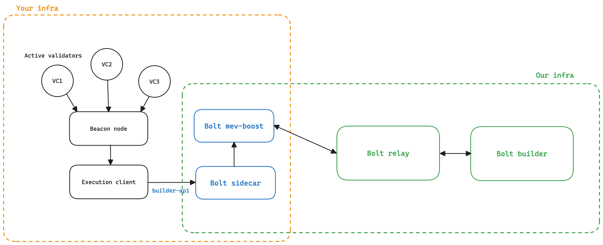

# Helder Devnet Guide

- Original Helder devnet document: [Helder Testnet](https://www.notion.so/ETH-CC-Testnet-Helder-fdc109a513cb44a68fe70f7038f2690b?pvs=21)
- Explorer: https://dora.helder-devnets.xyz/
- EL RPC: https://rpc.helder-devnets.xyz/
- Bootnode: https://bn.bootnode.helder-devnets.xyz/
- Config repos: https://github.com/Commit-Boost/helder-devnets
- Bolt relay info: http://135.181.191.125:9060/

## Components

The components that need to run to test Bolt on a devnet are:

- Execution client
- Beacon node
- Active validators
- **Bolt sidecar**
- **Bolt mev-boost**
- **Bolt relay**
- **Bolt builder**

We will run an instance of the Bolt relay and Bolt builder, and can run the Bolt sidecar and modified mev-boost if required. Schematic:



# Setup

- Copy https://github.com/Commit-Boost/helder-devnets/tree/master/network-configs/devnet-0/metadata to a local directory (`$DEVNET_PATH`).
- Generate a JWT for the engine API: `openssl rand -hex 32 | tr -d "\n" > jwtsecret`

## Execution Client

Geth:

```bash
geth init --datadir=$DATADIR --state.scheme=hash $DEVNET_PATH/genesis.json \
    --syncmode=full \
    --state.scheme=hash \
    --networkid=7014190335 \
    --verbosity=3 \
    --http \
    --http.port=8545 \
    --http.addr=0.0.0.0 \
    --http.vhosts=* \
    --http.corsdomain=* \
    --http.api=admin,engine,net,eth,web3,debug \
    --ws \
    --ws.addr=0.0.0.0 \
    --ws.port=8546 \
    --ws.api=admin,engine,net,eth,web3,debug \
    --ws.origins=* \
    --authrpc.port=8551 \
    --authrpc.addr=0.0.0.0 \
    --authrpc.vhosts=* \
    --authrpc.jwtsecret=jwtsecret \
    --metrics \
    --metrics.addr=0.0.0.0 \
    --metrics.port=6060 \
    --port=30303 \
    --bootnodes=enode://c15b5973b8fc6e5152d1d442512e5024b25883f2e002564cfa29cc3b748d687756c9f674f021f142eeea5711697a3d43d2bc36f13b1e20fe11b341676921430e@18.192.40.76:30303?discport=30303,enode://35cd13c4d555d70b39aafa806f817c4707397f7f9b7a1d43237f73d279c318fda0e4ba8a4b10d1f8b7771992804209aa028f74bd846afc86d016c4728a1c5268@35.156.177.215:30303?discport=30303,enode://dba7a24e543cc924178ed7e0066e5e40caa17607474a25b50e4bea7b565dee9719970a33e3e5beb4ad84832dad91bd9fe8de1f6cb1c6a7cb6e90c3bc10a20c67@18.199.185.236:30303?discport=30303,enode://a3317a4ec26ad3cedddb1951105699757fc74ed35c7bc6e31a6fe08b383fad3540ccf7c2f6d617411c74a22cf81a8a3898cf845c7a1501a969229c6ee046042f@52.28.153.174:30303?discport=30303 \
    --nat=extip:$EXTERNAL_IP
```

## Beacon Node

> [!IMPORTANT]  
> The beacon node’s `builder-api` should point to the Bolt sidecar API to activate Bolt! It MUST also have
> the following flags enabled:
>
> ```
> --always-prefer-builder-payload
> --builder-fallback-disable-checks
> ```
>
> These flags ensure that no local payload is produced that does not respect the commitments made.

Lighthouse:

```bash
lighthouse beacon_node \
    --debug-level=info \
    --datadir=/data/lighthouse/beacon-data \
    --disable-enr-auto-update \
    --enr-address=$EXTERNAL_IP \
    --enr-udp-port=9000 \
    --enr-tcp-port=9000 \
    --listen-address=0.0.0.0 \
    --http \
    --http-address=0.0.0.0 \
    --http-port=4000 \
    --http-allow-sync-stalled \
    --always-prepare-payload \
    --prepare-payload-lookahead=12000 \
    --slots-per-restore-point=32 \
    --disable-packet-filter \
    --checkpoint-sync-url=https://bn.bootnode.helder-devnets.xyz/ \
    --execution-endpoints=http://127.0.0.1:8551 \
    --suggested-fee-recipient=$COINBASE_ADDRESS \
    --subscribe-all-subnets \
    --metrics \
    --metrics-address=0.0.0.0 \
    --metrics-allow-origin=* \
    --metrics-port=5054 \
    --enable-private-discovery \
    --testnet-dir=$DEVNET_PATH \
    --jwt-secrets=jwtsecret \
    --boot-nodes=enr:-Iq4QK3EWjpB_Wh4Nh9qDWsIlkwCo-ltVJIOZintRmXlq4BqSO3MgChdjo5bNSc_dBVcnhM_CZidGE-CMjazCeJhn7OGAZA6aA31gmlkgnY0gmlwhDQ6SFGJc2VjcDI1NmsxoQN4MIj6Xe7PBxpfvrpyDe2OkrcIq0gdj38hHXpWjB6Zl4N1ZHCCIyk,enr:-LK4QJIhICEs-MIlzVGEOJRco5B3eR1HjsoPrnlNdCifHlT_NQCaY51Z-ntBIgUQmNRcEBqBogOhh43BYdMR_d9Z-DgKh2F0dG5ldHOIAAYAAAAAAACEZXRoMpBLd1oGYBMnNj9CDwAAAAAAgmlkgnY0gmlwhDQ6SFGJc2VjcDI1NmsxoQOy0WhSLuSWpKXex_SG9dn4bOk-LURo7ZjaUuQ1Fbdbk4N0Y3CCIyiDdWRwgiMo,enr:-MS4QKp7W7f8BsoB04SovlJFZDhs67ZgFK_h5TwBXItLoJfGMPDCLnReASmmig_7kxCNf08e68FrCVM3FcPV0ttR92sWh2F0dG5ldHOIAAAwAAAAAACEZXRoMpBLd1oGYBMnNj9CDwAAAAAAgmlkgnY0gmlwhBLAKEyEcXVpY4IjKYlzZWNwMjU2azGhAxUCn447F0j2DEeA-PqFdp5GP3VpXRWgia2yKjeT62G2iHN5bmNuZXRzAIN0Y3CCIyiDdWRwgiMo,enr:-MS4QAvcfEmj00GqJcvkjcvQIhBi6pJQ9Znnp2Hr_Hh4YEOzWMENkleVt-vGAAgz8bhFedR5JkcfuzHTzY-9EpB43n4Ph2F0dG5ldHOIAAAAAAAAAMCEZXRoMpBLd1oGYBMnNj9CDwAAAAAAgmlkgnY0gmlwhCOcsdeEcXVpY4IjKYlzZWNwMjU2azGhAo8AZqqrsuBrbMLHdavhLdAxLWpcSk-SPDuqjJt5Fe_oiHN5bmNuZXRzD4N0Y3CCIyiDdWRwgiMo,enr:-MS4QDvmIhX8vI8_kK62XXbO9gnrm-YuzXKo-OS07uRKLgijLfxeUPvtKU-Ps2RnxOEoNq9RPqhbeVdAVYO71eAJvRkPh2F0dG5ldHOIAAAAAAAAABiEZXRoMpBLd1oGYBMnNj9CDwAAAAAAgmlkgnY0gmlwhBLHueyEcXVpY4IjKYlzZWNwMjU2azGhA4ZmLIctckMGhbOwtpgUI2RNeH2S7LXmwpX_onBAfW_AiHN5bmNuZXRzD4N0Y3CCIyiDdWRwgiMo,enr:-MS4QGcM6eqjhCp_Ag7gMzkU8ks7F-S2QsoIdeEsbcB8TPefYK19ymkwmTcpmZfbTJRMwwAvqdOMmGWEAI5GYv_7xZwTh2F0dG5ldHOIAAAAAAAMAACEZXRoMpBLd1oGYBMnNj9CDwAAAAAAgmlkgnY0gmlwhDQcma6EcXVpY4IjKYlzZWNwMjU2azGhAnXOGXUDHbcgGJeZ9-ftr8cihtkyfUfNlpQNe9G8P2PCiHN5bmNuZXRzD4N0Y3CCIyiDdWRwgiMo \
    --builder=localhost:18551 \ # This will be the Bolt builder API
    --always-prefer-builder-payload \ # This will always prefer the builder payload
    --builder-fallback-disable-checks # This will disable chain health checking and local building in response
```

## Bolt Sidecar + Bolt MEV-Boost

Sidecar code: https://github.com/chainbound/bolt/tree/unstable/bolt-sidecar

Modified mev-boost code: https://github.com/chainbound/bolt/tree/unstable/mev-boost

We provide a Docker compose script to run these 2 together in the root directory. First, update the `launch.env` file with your correct values. The relay is set to our Bolt-enabled relay.

> [!TIP]  
> If the services below are running on the host machine, the host should be "host.docker.internal".

```bash
# Beacon client API. Example: "host.docker.internal:3500"
BEACON_API_URL=""
# Execution client API
EXECUTION_API_URL=""
# Engine API
ENGINE_API_URL=""
# Engine API JWT
JWT_HEX=""
# Fee recipient
FEE_RECIPIENT=""
# The Bolt RPC port. This port must be exposed!
BOLT_RPC_PORT="8000"

# BLS commitment signing key, i.e. 0x4d129a19df86a0f5345bad4cc6f249ec2a819ccc3386895beb4f7d98b3db6235
# Some other random keys:
# - 0x02cbb9bb3163321cd23e184dc5cb605587a29c87fa542eb36631db1743fc6893
# - 0x5dd026998c8f3d54eb16b00f35b9e3ed7d35367f91d10bc68fe8df431e0080c6
# - 0x44bd4ef71104d2a574c21433070c3b18e6888f692f6e8f7b38e8815f42d25528
SIGNING_KEY=""

# The validator indexes for which to accept commitments. Values accepted:
# - comma-separated indexes, e.g. "1,2,3,4"
# - range of indexes, e.g. "1..4" (includes both 1 and 4)
# - a mix of both, e.g. "1,2,4..8" (includes 1, 2, 4, 5, 6, 7, 8)
VALIDATOR_INDEXES=""

# Bolt-enabled relay on Helder
BOLT_RELAY="http://0xa55c1285d84ba83a5ad26420cd5ad3091e49c55a813eee651cd467db38a8c8e63192f47955e9376f6b42f6d190571cb5@135.181.191.125:9062"

# Genesis fork version for Helder
GENESIS_FORK_VERSION="0x10000000"
```

Then, simply run `docker compose up`. This will start the sidecar and the modified mev-boost.

> [!IMPORTANT]  
> The Bolt RPC port must be exposed to the internet to allow users to send commitment requests to it.
> The RPC will be registered in an on-chain registry in the next step.

## Validators

In this section we cover how one should configure their validators and register them in the Bolt on-chain [registry](https://github.com/chainbound/bolt/tree/unstable/bolt-contracts#registry).

### Starting Up

Lighthouse VC:

```bash
lighthouse vc ... --builder-proposals --prefer-builder-proposals
```

The `--builder-proposals` and `--prefer-builder-proposals` flags are required so that Lighthouse won’t rely on EL self-building, which in some cases could lead to commitment faults. The Bolt sidecar deals with PBS failures gracefully and will build its own local block in case the relay / builder goes down.

### Bolt Registration

Next up, we need to register the validators in the Bolt smart contract registry, for which we provide some Forge scripts:

- Install the Foundry tools:

```bash
curl -L https://foundry.paradigm.xyz | bash
source $HOME/.bashrc
foundryup
```

- Clone the Bolt repo and navigate to the [contracts](https://github.com/chainbound/bolt/tree/unstable/bolt-contracts) directory:

```bash
git clone https://github.com/chainbound/bolt
cd bolt-contracts
forge install
```

- Batch register validators (**private key address must be funded with at least 10 ETH**).

```bash
# The ECDSA private key of your Bolt operator
export PRIVATE_KEY="0x..."
# The Bolt RPC address (public)
# WARNING: this needs to map to the Bolt sidecar RPC port - what we call "BOLT_RPC_PORT" in the above section.
# This must be publicly accessible (e.g. no localhost or 0.0.0.0)!
export RPC_ADDR="http://x.x.x.x:8000"
# Your validators
export VALIDATOR_INDEXES="1,2,3,4"

# Register validators
forge script script/RegisterValidators.s.sol --rpc-url https://rpc.helder-devnets.xyz --broadcast --legacy
```

In the future, this will be the private key used for signing commitments. For now we just use the registry for RPC discovery. Any front-ends active on Helder will read this registry to match validator indexes to RPC endpoints, so make sure the RPC endpoint is correct and public!
